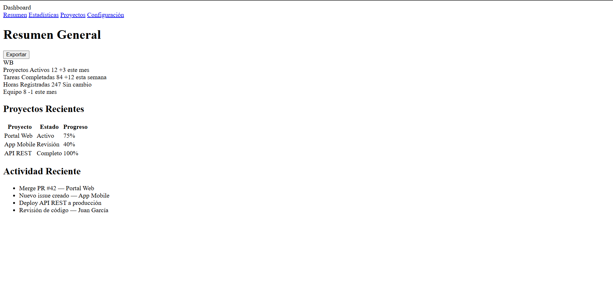
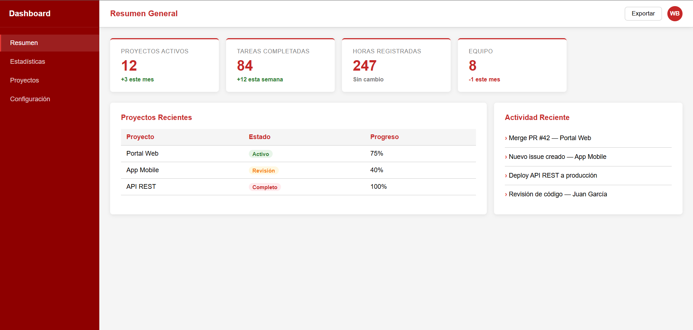

# Dashboard CSS3 — William Balaguera

## Descripción
Dashboard web responsivo desarrollado como laboratorio de la Unidad 3
del curso de Programación Web. Implementa CSS Grid para la estructura
de página y Flexbox para los componentes internos, sin frameworks CSS
externos.

## Técnicas CSS implementadas
- CSS Grid con grid-template-areas (layout principal)
- CSS Grid con repeat(auto-fill, minmax()) (stats responsivas)
- CSS Grid 2fr/1fr (panel principal y lateral)
- Flexbox en columna (sidebar y nav-links)
- Flexbox en fila (topbar, stat-cards, avatar)
- Custom Properties centralizadas en :root
- Nomenclatura BEM en modificadores de clase

## Cómo ejecutar
1. Clonar: `git clone https://github.com/WilliamBalaguera/balaguera-post2-u3`
2. Abrir en VS Code → clic derecho en index.html → Open with Live Server
3. Navegar a `http://localhost:5500`

## Capturas de pantalla

